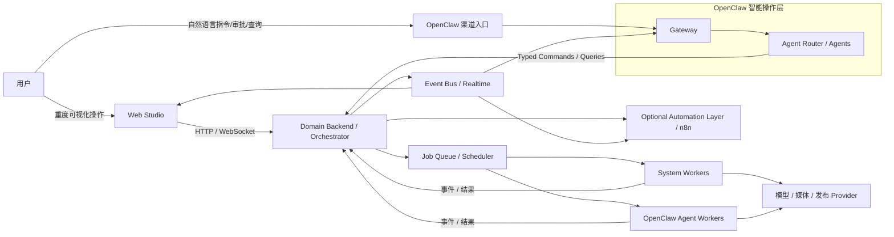

# 系统架构与角色边界

版本：v0.1  
状态：架构基线  
适用范围：MVP
关联文档：
- `docs/product/mvp-prd-v0.2.md`
- `docs/web/console-spec-v0.1.md`
- `docs/architecture/feasibility-and-tech-selection-v0.1.md`
- `docs/openclaw/openclaw-integration-spec-v0.1.md`
- `docs/specs/backend-data-api-spec-v0.1.md`
- `docs/specs/state-machine-and-error-code-spec-v0.1.md`
- `docs/architecture/n8n-adoption-decision-v0.1.md`

## 1. 文档目标

本文档用于回答当前阶段最关键的系统架构问题：

- 整个系统应该长成什么样
- OpenClaw 在系统里最合适扮演什么角色
- Web、业务后端、执行层、OpenClaw 之间应该如何分工
- 状态、版本、审核、回退应由谁负责
- 哪些事情适合由系统处理，哪些事情适合交给 agent 处理

本文档不是 OpenClaw 官方能力介绍，也不是具体 API 细节文档，而是一份用于统一产品、技术和实现边界的目标架构说明。

## 2. 总体结论

当前最推荐的系统形态是：

`Seko 风格 Web Studio + 业务编排后端 + 执行层 + OpenClaw 智能操作层`

一句话定义：

Web 是正式生产界面，后端是业务真相层，执行层负责真正运行任务，OpenClaw 负责自然语言交互、通知、轻操作和智能协作。

这意味着：

- 不应把 OpenClaw 当成整套业务系统本身
- 不应把 OpenClaw session 当成项目状态真相
- 不应让前端直接依赖 agent 会话作为正式业务对象
- 应保留一套独立的 Seko 风格 Web 系统作为主工作台
- 应允许 OpenClaw 成为另一种入口，但不是唯一入口

## 3. 设计判断

推荐采用该架构的原因如下：

- Seko 类产品的核心价值是流程可控、状态透明、版本可追溯、失败可恢复，而不是纯聊天体验
- 分镜、镜头、版本替换、模型切换、重试、发布等操作具有强视觉和强结构特征，适合在 Web 中承载
- 审核、回退、发布、版本恢复都要求稳定状态机，不能放在 agent 会话记忆中
- 用户又确实需要一个自然语言入口，用于快速发起、查询、催办、审批和异常解释
- OpenClaw 天然适合作为 chat gateway、多 agent 入口和受控执行代理，但不适合作为业务真相数据库

## 4. 目标架构

### 4.1 架构总览

### 4.2 核心判断

系统应分为四层，并允许外挂一层可选外围自动化：

- 产品交互层：Seko 风格 Web Studio
- 业务真相层：Domain Backend / Orchestrator
- 执行层：System Workers + Agent Workers
- 对话协作层：OpenClaw Gateway + Agents
- 可选外围自动化层：`n8n` 等集成自动化服务

最关键的原则是：

- 业务真相必须只有一份
- 所有正式状态都落在业务后端
- 所有用户操作都应被翻译为结构化命令
- 所有执行结果都应回写为结构化事件
- OpenClaw 可以驱动系统，但不拥有系统主状态

## 5. 模块边界

### 5.1 Web Studio

职责：

- 承载 Seko 风格的正式生产界面
- 提供分镜、镜头、素材、版本、模型、发布等核心操作
- 展示项目、节点、Run、版本、审核和日志
- 为精细编辑和视觉确认提供主工作台

必须负责的能力：

- 分镜生成与编辑
- 镜头版本选择与替换
- 模型选择与批量重试
- 素材引用与素材管理
- 视频生成进度查看
- 发布前确认与发布配置

不应负责的能力：

- 直接决定状态机合法性
- 直接执行长任务
- 直接持有任务调度逻辑

### 5.2 Domain Backend / Orchestrator

职责：

- 维护 `Project / Episode / PlannerSession / Stor…2126 tokens truncated…1.md`
- `docs/architecture/feasibility-and-tech-selection-v0.1.md`
- `docs/openclaw/openclaw-integration-spec-v0.1.md`
- `docs/specs/backend-data-api-spec-v0.1.md`

## 1. 文档目标

本文档用于回答一个具体架构问题：

- 在实现文档、图片、分镜、生成、发布等流程时，是否有必要引入 `n8n`
- 如果引入，应该放在系统的哪一层
- 如果不引入到核心链路，原因是什么
- 哪些场景适合用 `n8n`
- 哪些场景不适合用 `n8n`

本文档给出的是架构决策，而不是对 `n8n` 全能力的完整介绍。

## 2. 决策结论

结论是：

- 不建议把 `n8n` 作为本系统的核心工作流引擎
- 可以引入 `n8n`，但只建议放在外围自动化层
- `n8n` 最适合作为集成胶水，而不是项目状态机和生产主链路的承载层

一句话判断：

`核心制作链路不要用 n8n，外围自动化和通知可以用 n8n。`

## 3. 为什么不建议放进核心链路

本系统的核心不是普通自动化流程，而是强业务语义的生产系统。

核心链路至少包含：

- `Project`
- `PipelineNode`
- `Run`
- `Version`
- `Review`
- `Asset`
- `PublishRecord`

围绕这些对象，系统必须稳定处理：

- 节点推进
- 待审核状态
- 编辑后继续
- 镜头级重试
- 版本替换与生效
- 回退导致下游失效
- 发布回执与审计

这些能力要求：

- 强状态机
- 明确版本链
- 精细权限和审计
- 长任务稳定性
- 二进制产物治理
- 可编程恢复逻辑

`n8n` 更适合“把系统 A 接到系统 B”，不适合承载这种强业务真相和复杂恢复语义。

## 4. n8n 的优势

如果只看外围自动化，`n8n` 有明显优势：

- Webhook 与第三方集成快
- 对接 SaaS、消息系统、表单和数据库方便
- 支持 AI Agent、Chat 和 Human-in-the-loop
- 支持子工作流复用
- 支持队列模式与并发控制
- 适合快速验证非核心流程自动化

因此，如果目标是快速把飞书通知、文档同步、外围审批、报表汇总串起来，`n8n` 是值得考虑的。

## 5. n8n 不适合作为核心工作流引擎的原因

### 5.1 核心状态机不适合放进去

本项目的关键复杂度在于：

- 审核是正式业务动作
- 版本恢复会影响下游有效性
- 一个节点可能有多次 `Run`
- 一个节点的当前有效版本不等于最近一次执行结果
- 当前项目状态与当前节点状态需要同时成立

这类逻辑应该落在自己的 `Domain Backend / Orchestrator` 中，而不是外包给工作流平台。

### 5.2 镜头级和版本级操作太细

Seko 风格系统里，用户需要做的是：

- 替换某个镜头版本
- 只重试一组镜头
- 针对失败镜头切换模型
- 引用素材并重新生成
- 对分镜做编辑后继续

这些都要求：

- 细粒度业务对象
- 复杂 UI 交互
- 明确的状态回写

`n8n` 适合节点式流程，不适合承载这种高密度产品交互。

### 5.3 二进制产物会很快变重

图片、音频、字幕、视频、导出结果都属于重量级二进制数据。

而本系统会持续处理：

- 镜头图
- 角色图
- 音频文件
- 字幕文件
- 成片视频
- 发布回执和预览链接

这些内容更适合进入对象存储和正式业务系统管理，而不是让工作流平台承担核心产物生命周期。

### 5.4 恢复逻辑会越来越复杂

本项目不是“执行失败就整体重来”，而是：

- 某节点失败后局部重试
- 某版本恢复后下游节点失效
- 人工编辑后继续推进
- 部分镜头成功、部分镜头失败
- 最终导出失败但前序资产仍然有效

这种恢复模型如果放在 `n8n` 里，会让工作流越来越像业务代码，但缺少真正适合这类系统的状态建模能力。

## 6. n8n 适合放在哪一层

最适合的定位是：

`Optional Peripheral Automation Layer`

也就是：

- 不进入业务真相层
- 不进入核心状态机
- 不替代执行调度器
- 只负责外围自动化和对外集成

推荐放置位置：

- `Domain Backend` 之外
- `Web Studio` 之外
- `Execution Layer` 之外
- 作为一层可选的集成自动化服务存在

## 7. 建议使用 n8n 的场景

以下场景适合引入 `n8n`：

- 飞书 / Slack / Telegram 通知
- 待审核提醒和催办
- 导出完成通知
- 发布完成回写外部系统
- 项目日报、周报、异常汇总
- 文档同步到 Notion / 飞书文档 / Confluence
- 非核心审批流分发
- 运营和内部协作自动化

这些场景的共同特点是：

- 即使失败，也不会破坏正式业务真相
- 可以异步处理
- 对版本生效和状态机合法性影响小
- 更像系统外围胶水，而不是产品主链路

## 8. 不建议使用 n8n 的场景

以下场景不建议交给 `n8n`：

- 项目状态机推进
- 节点合法性判断
- 审核通过 / 编辑后继续后的正式版本生效
- 回退与下游失效判定
- 镜头级版本替换
- 发布主链路
- 长任务主调度
- 作为最终业务审计来源

这些场景必须保留在自己的后端里。

## 9. 与 OpenClaw 的关系

`OpenClaw` 和 `n8n` 的定位也不一样：

- `OpenClaw`：自然语言入口、协作入口、智能操作层、可插拔执行代理
- `n8n`：外围自动化、第三方系统胶水、通知和运营自动化

因此，不建议用 `n8n` 取代 `OpenClaw`，也不建议用 `n8n` 取代业务后端。

如果两者都接入，推荐关系应是：

- 用户通过 Web 或 OpenClaw 发起正式操作
- 后端更新正式状态
- 某些外围事件由后端再触发 `n8n`
- `n8n` 负责通知、同步、汇总、外部系统回写

## 10. 推荐落地方式

如果当前阶段要把 `n8n` 纳入整体方案，建议采用以下边界：

### 方案 A：当前最推荐

- 主系统先不依赖 `n8n`
