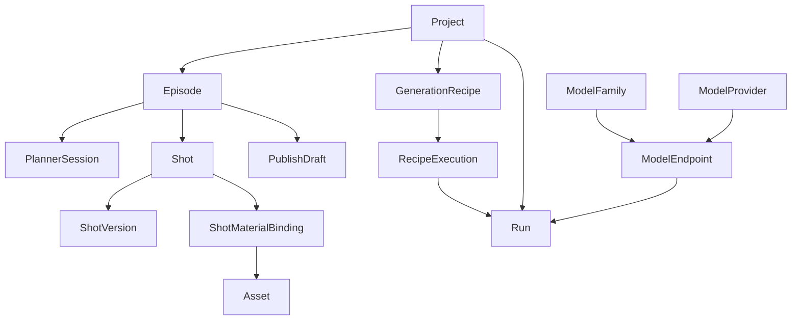

# 后端系统设计稿（v0.3）

版本：v0.3  
日期：2026-03-13  
状态：可开工设计基线

## 1. 文档目的

本文件用于把后端从“前端状态机 + mock + schema 设计稿”推进到“可实施的真实系统设计”。

本稿覆盖以下内容：

1. MySQL 版领域模型
2. 表结构清单
3. `Recipe / Run / Model Registry` 设计
4. API 草案
5. Worker 执行链路
6. 从当前前端状态机迁移到后端真状态的步骤

本文件与以下文档配套使用：

1. `docs/specs/backend-replanning-and-recipe-model-spec-v0.3.md`
2. `docs/specs/backend-data-api-spec-v0.3.md`
3. `docs/specs/database-schema-spec-v0.3.md`
4. `prisma/schema.prisma`

## 2. 设计目标

后端系统需要满足以下目标：

1. 支撑 Explore / Planner / Creation / Publish 全流程持久化。
2. 把当前前端本地状态机中的业务真相迁回后端。
3. 支撑长任务编排、失败重试、历史回放和审计。
4. 支撑“类似视频一键复用生成”。
5. 支撑同一逻辑模型在官方与第三方 provider 下的区分与追踪。
6. 以 `MySQL + Prisma + Worker` 为基础落地。
7. 兼容同步 provider 和“提交任务后异步查询结果”的 provider。
8. 支撑最小用户系统：用户自注册、账号密码登录、会话维持、数据按用户隔离。

非目标：

1. 第一阶段不做微服务拆分。
2. 第一阶段不做复杂实时推送，默认先轮询。
3. 第一阶段不把所有 AI provider 统一抽成高度泛化插件系统。
4. 第一阶段不引入 OAuth、SSO、组织空间和复杂权限模型。

补充边界：

1. fallback 策略只在同一 `ModelFamily` 的候选 endpoint 之间生效。
2. callback 与 polling 只负责推进 `Run`，不允许绕过统一写库逻辑。

## 3. 系统总览

### 3.1 运行时组件

建议采用以下运行时组件：

1. `apps/web`
2. `apps/api`
3. `apps/worker`
4. `MySQL`
5. `Redis`
6. `Object Storage`
7. `Session Store`（可直接复用 MySQL 或 Redis）

### 3.2 分层职责

#### Web

职责：

1. 展示聚合态工作区
2. 提交命令
3. 轮询 `Run` 和工作区数据
4. 管理纯 UI 临时状态

#### API

职责：

1. 提供 Query / Command 接口
2. 聚合数据库数据为工作区 DTO
3. 写入业务对象
4. 创建与驱动 `Run`
5. 处理鉴权、校验、幂等、审计
6. 提供 provider callback / polling 调度入口
7. 处理注册、登录、登出、会话校验

#### Worker

职责：

1. 消费任务队列
2. 调用外部模型 provider
3. 写回资产、版本、运行结果
4. 更新 `Run / EventLog`
5. 对异步 provider 持续轮询直到成功、失败或超时

## 4. MySQL 版领域模型

### 4.1 聚合根

建议以后端实现为准的核心聚合根如下：

1. `Project`
2. `Episode`
3. `PlannerSession`
4. `Shot`
5. `PublishDraft`
6. `GenerationRecipe`
7. `RecipeExecution`
8. `Run`
9. `ModelFamily`
10. `ModelProvider`
11. `ModelEndpoint`
12. `User`
13. `UserSession`

### 4.2 聚合关系



### 4.3 MySQL 约束策略

由于采用 `MySQL`，不依赖 partial unique index 实现“只有一个 active”。

因此采用以下显式引用策略：

1. `Project.currentEpisodeId`
2. `Episode.activePlannerSessionId`
3. `Shot.activeVersionId`
4. `Shot.activeMaterialBindingId`
5. `PublishDraft.activeExportRunId`

原则：

1. 子表可保留状态字段用于展示和历史回放。
2. “当前生效对象”以主表外键为唯一事实来源。
3. 应用层负责双写校验和状态收敛。

## 5. 表结构清单

以下为建议的核心表结构清单。字段名按后端实现可做微调，但语义应保持一致。

### 5.1 项目与剧集层

#### `users`

主要字段：

1. `id`
2. `email`
3. `password_hash`
4. `display_name`
5. `status`
6. `created_at`
7. `updated_at`
8. `last_login_at`

约束：

1. `email` 唯一
2. 只保存 `password_hash`，不保存明文密码

#### `user_sessions`

主要字段：

1. `id`
2. `user_id`
3. `session_token_hash`
4. `expires_at`
5. `revoked_at`
6. `created_at`
7. `last_seen_at`
8. `ip_address`
9. `user_agent`

约束：

1. `session_token_hash` 唯一
2. 过期或撤销后不得继续使用

#### `projects`

主要字段：

1. `id`
2. `title`
3. `brief`
4. `content_mode`
5. `execution_mode`
6. `aspect_ratio`
7. `status`
8. `current_episode_id`
9. `cover_asset_id`
10. `created_by_id`
11. `created_at`
12. `updated_at`
13. `archived_at`

建议索引：

1. `(status, updated_at)`
2. `(created_by_id, updated_at)`

#### `episodes`

主要字段：

1. `id`
2. `project_id`
3. `episode_no`
4. `title`
5. `summary`
6. `status`
7. `active_planner_session_id`
8. `current_stage`
9. `created_at`
10. `updated_at`

建议索引：

1. `(project_id, episode_no)`
2. `(project_id, status, updated_at)`

### 5.2 策划层

#### `planner_sessions`

主要字段：

1. `id`
2. `project_id`
3. `episode_id`
4. `status`
5. `is_active`
6. `outline_confirmed_at`
7. `config_json`
8. `created_by_id`
9. `created_at`
10. `updated_at`

建议索引：

1. `(episode_id, created_at desc)`
2. `(project_id, episode_id, is_active)`

#### `planner_messages`

主要字段：

1. `id`
2. `planner_session_id`
3. `role`
4. `content`
5. `metadata_json`
6. `created_at`

#### `planner_references`

主要字段：

1. `id`
2. `planner_session_id`
3. `asset_id`
4. `reference_type`
5. `sort_order`
6. `created_at`

#### `planner_outline_versions`

主要字段：

1. `id`
2. `planner_session_id`
3. `version_number`
4. `requirement_text`
5. `outline_snapshot_json`
6. `status`
7. `confirmed_at`
8. `created_at`
9. `updated_at`

唯一约束：

1. `(planner_session_id, version_number)`

#### `planner_refinement_versions`

主要字段：

1. `id`
2. `planner_session_id`
3. `outline_version_id`
4. `version_number`
5. `trigger_type`
6. `instruction`
7. `status`
8. `progress_percent`
9. `doc_snapshot_json`
10. `is_active`
11. `created_at`
12. `updated_at`
13. `finished_at`

唯一约束：

1. `(planner_session_id, version_number)`

### 5.3 创作层

#### `shots`

主要字段：

1. `id`
2. `project_id`
3. `episode_id`
4. `sequence_no`
5. `title`
6. `subtitle_text`
7. `narration_text`
8. `image_prompt`
9. `motion_prompt`
10. `preferred_model_family_id`
11. `resolution`
12. `duration_mode`
13. `duration_seconds`
14. `crop_to_voice`
15. `status`
16. `active_version_id`
17. `active_material_binding_id`
18. `canvas_transform_json`
19. `last_error_code`
20. `last_error_message`
21. `created_at`
22. `updated_at`

唯一约束：

1. `(episode_id, sequence_no)`

#### `shot_versions`

主要字段：

1. `id`
2. `shot_id`
3. `project_id`
4. `episode_id`
5. `version_number`
6. `label`
7. `media_kind`
8. `asset_id`
9. `model_family_id`
10. `model_endpoint_id`
11. `provider_id`
12. `status`
13. `prompt_snapshot_json`
14. `request_config_snapshot_json`
15. `created_by_run_id`
16. `created_at`

唯一约束：

1. `(shot_id, version_number)`

#### `assets`

主要字段：

1. `id`
2. `project_id`
3. `episode_id`
4. `asset_type`
5. `mime_type`
6. `storage_key`
7. `cdn_url`
8. `preview_url`
9. `duration_ms`
10. `width`
11. `height`
12. `size_bytes`
13. `checksum`
14. `metadata_json`
15. `created_by_run_id`
16. `created_at`

建议索引：

1. `(project_id, asset_type, created_at)`
2. `(episode_id, asset_type, created_at)`

#### `shot_material_bindings`

主要字段：

1. `id`
2. `shot_id`
3. `asset_id`
4. `source_type`
5. `slot_name`
6. `sort_order`
7. `is_active`
8. `created_at`

### 5.4 音频与对口型层

#### `voice_drafts`

主要字段：

1. `id`
2. `project_id`
3. `episode_id`
4. `mode`
5. `audio_asset_id`
6. `voice_name`
7. `emotion`
8. `volume`
9. `speed`
10. `snapshot_json`
11. `updated_at`

#### `music_drafts`

主要字段：

1. `id`
2. `project_id`
3. `episode_id`
4. `mode`
5. `prompt`
6. `track_asset_id`
7. `track_name`
8. `volume`
9. `applied`
10. `snapshot_json`
11. `updated_at`

#### `lipsync_drafts`

主要字段：

1. `id`
2. `project_id`
3. `episode_id`
4. `mode`
5. `input_mode`
6. `base_shot_id`
7. `audio_asset_id`
8. `voice_model_family_id`
9. `emotion`
10. `volume`
11. `speed`
12. `dialogues_json`
13. `updated_at`

说明：

1. 这三张表第一阶段允许保留较多 snapshot 字段。
2. 等业务稳定后再继续拆到更细的结构化表。

### 5.5 发布层

#### `publish_drafts`

主要字段：

1. `id`
2. `project_id`
3. `episode_id`
4. `title`
5. `intro_text`
6. `script_text`
7. `cover_asset_id`
8. `final_video_asset_id`
9. `status`
10. `active_export_run_id`
11. `channel_config_json`
12. `updated_at`

#### `publish_records`

主要字段：

1. `id`
2. `publish_draft_id`
3. `channel`
4. `status`
5. `external_post_id`
6. `response_snapshot_json`
7. `created_at`
8. `finished_at`

### 5.6 配方层

#### `generation_recipes`

主要字段：

1. `id`
2. `project_id`
3. `episode_id`
4. `source_run_id`
5. `name`
6. `kind`
7. `definition_json`
8. `version`
9. `is_template`
10. `created_by_id`
11. `created_at`
12. `updated_at`

#### `recipe_executions`

主要字段：

1. `id`
2. `recipe_id`
3. `project_id`
4. `episode_id`
5. `status`
6. `input_asset_bundle_id`
7. `resolved_config_json`
8. `output_project_id`
9. `output_episode_id`
10. `run_group_id`
11. `created_by_id`
12. `created_at`
13. `finished_at`

### 5.7 模型目录层

#### `model_families`

主要字段：

1. `id`
2. `slug`
3. `name`
4. `kind`
5. `capability_json`
6. `is_active`
7. `created_at`
8. `updated_at`

#### `model_providers`

主要字段：

1. `id`
2. `code`
3. `name`
4. `provider_type`
5. `base_url`
6. `credential_ref`
7. `is_active`
8. `created_at`
9. `updated_at`

#### `model_endpoints`

主要字段：

1. `id`
2. `family_id`
3. `provider_id`
4. `remote_model_key`
5. `label`
6. `status`
7. `priority`
8. `cost_config_json`
9. `rate_limit_config_json`
10. `default_params_json`
11. `created_at`
12. `updated_at`

唯一约束：

1. `(provider_id, remote_model_key)`

### 5.8 运行账本层

#### `runs`

主要字段：

1. `id`
2. `project_id`
3. `episode_id`
4. `recipe_execution_id`
5. `parent_run_id`
6. `run_type`
7. `resource_type`
8. `resource_id`
9. `status`
10. `executor_type`
11. `model_family_id`
12. `model_endpoint_id`
13. `provider_id`
14. `remote_model_key`
15. `input_json`
16. `output_json`
17. `error_code`
18. `error_message`
19. `idempotency_key`
20. `provider_job_id`
21. `provider_status`
22. `provider_callback_token`
23. `last_polled_at`
24. `next_poll_at`
25. `poll_attempt_count`
26. `started_at`
27. `finished_at`
28. `created_at`

建议索引：

1. `(project_id, run_type, status, created_at desc)`
2. `(episode_id, status, created_at desc)`
3. `(resource_type, resource_id, created_at desc)`
4. `(recipe_execution_id, created_at)`
5. `(idempotency_key)`

#### `event_logs`

主要字段：

1. `id`
2. `project_id`
3. `episode_id`
4. `run_id`
5. `source`
6. `level`
7. `event_type`
8. `message`
9. `payload_json`
10. `created_at`

## 6. Recipe / Run / Model Registry 设计

### 6.1 Recipe 设计原则

`GenerationRecipe` 记录的是“如何生成”，不是“生成结果本身”。

一个 recipe 至少包含：

1. workflow steps
2. prompt templates
3. model resolution strategy
4. material slot definitions
5. render params
6. audio / lipsync / export policies

### 6.2 Recipe JSON 建议结构

```json
{
  "kind": "multi_shot_video",
  "version": 1,
  "slots": [
    { "name": "subject_image", "type": "image", "required": true },
    { "name": "style_reference", "type": "image", "required": false }
  ],
  "workflow": [
    { "step": "planner_expand", "enabled": true },
    { "step": "generate_storyboard", "enabled": true },
    { "step": "generate_image", "enabled": true },
    { "step": "generate_video", "enabled": true },
    { "step": "generate_music", "enabled": false }
  ],
  "modelStrategy": {
    "image": { "family": "seko-image", "policy": "preferOfficial" },
    "video": { "family": "wanx-2.1-video", "policy": "preferLowestCost" }
  },
  "prompts": {
    "image": "保持原视频风格，主体为 ${subject}",
    "video": "延续镜头语言，运动方式参考原记录"
  },
  "render": {
    "aspectRatio": "9:16",
    "resolution": "1080P"
  }
}
```

### 6.3 Run 设计原则

`Run` 是统一异步账本。

要求：

1. 所有异步动作必须创建 `Run`
2. 一个功能不允许另建平行主账本替代 `Run`
3. `Run` 必须能支持取消、重试、回放、失败审计

补充要求：

1. `Run` 必须兼容 provider 同步返回和异步返回两种模式。
2. 异步 provider 的外部任务 id 必须能在 `Run` 上追踪。

### 6.4 Model Registry 设计原则

`Model Registry` 不为 UI 展示而存在，而是为以下能力服务：

1. provider 切换
2. 成本治理
3. 失败兜底
4. 历史复现
5. recipe 复用

因此每次执行时必须把“解析后的 endpoint 选择结果”写入 `Run` 和产物快照。

### 6.5 第三方失败与 fallback 策略

第三方失败时遵循以下原则：

1. 失败先落 `Run` 和 `EventLog`。
2. 旧的可用产物不可被失败任务覆盖。
3. 自动 fallback 必须被显式记录。
4. 自动 fallback 只允许在同一 `ModelFamily` 内切换候选 endpoint。

建议策略：

1. `PROVIDER_TIMEOUT / PROVIDER_RATE_LIMITED`：允许有限自动重试。
2. `PROVIDER_BAD_RESPONSE / MODEL_PROVIDER_DISABLED`：允许切换候选 endpoint。
3. `VALIDATION_ERROR / WORKFLOW_CONFIG_INVALID`：直接失败，不自动重试。

### 6.6 第三方异步任务兼容模型

部分第三方 provider 的第一次调用只返回 `jobId / taskId / uuid`，后续需要轮询查询状态或等待 callback。

系统设计要求：

1. `Run.providerJobId` 保存第三方任务 id。
2. `Run.providerStatus` 保存第三方原始状态。
3. `Run.nextPollAt / lastPolledAt / pollAttemptCount` 支撑轮询调度。
4. callback 若存在，也只更新 `Run`，真正业务写库仍走统一服务层。

状态映射：

1. provider 返回 `submitted / queued / processing` 时，本地 `Run.status` 保持 `RUNNING`
2. provider 成功时，本地 `Run.status = COMPLETED`
3. provider 明确失败时，本地 `Run.status = FAILED`
4. 超过轮询阈值或总耗时阈值时，本地 `Run.status = TIMED_OUT`

### 6.7 模型解析策略

前端不直接传底层 provider 地址，而是传策略。

建议支持：

1. `preferOfficial`
2. `preferLowestCost`
3. `preferFastest`
4. `forceEndpointId`

后端根据策略将 `family` 解析为最终 `endpoint`。

## 7. API 草案

### 7.1 约定

统一响应格式：

```ts
type ApiEnvelope<T> =
  | { ok: true; data: T }
  | { ok: false; error: { code: string; message: string; details?: Record<string, unknown> } };
```

命令接口原则：

1. 成功提交命令不等于业务完成
2. 长任务类命令返回 `runId`
3. 前端通过轮询 `GET /api/runs/:runId` 或刷新工作区查询结果获取最终状态

鉴权约定：

1. 第一阶段采用最简单账号密码 + 服务端 session。
2. 登录成功后通过 HttpOnly Cookie 维持会话。
3. 所有 `/api/projects/*`、`/api/shots/*`、`/api/recipes/*`、`/api/runs/*` 默认要求登录。

### 7.2 查询接口

#### `POST /api/auth/register`

用途：

1. 用户自注册

请求：

```ts
interface RegisterRequest {
  email: string;
  password: string;
  displayName?: string;
}
```

#### `POST /api/auth/login`

用途：

1. 账号密码登录

#### `POST /api/auth/logout`

用途：

1. 撤销当前 session

#### `GET /api/auth/me`

用途：

1. 获取当前登录用户信息

返回：

```ts
interface MeResponse {
  id: string;
  email: string;
  displayName: string | null;
}
```

#### `GET /api/studio/projects`

用途：

1. 获取继续创作项目列表

#### `GET /api/studio/projects/:projectId`

用途：

1. 获取项目总览聚合
2. 包含当前 episode、阶段和关键摘要

#### `GET /api/projects/:projectId/planner/workspace`

请求参数：

1. `episodeId`

返回：

1. `PlannerWorkspaceDto`

#### `GET /api/projects/:projectId/creation/workspace`

请求参数：

1. `episodeId`

返回：

1. `CreationWorkspaceDto`

#### `GET /api/projects/:projectId/publish/workspace`

请求参数：

1. `episodeId`

返回：

1. `PublishWorkspaceDto`

#### `GET /api/runs/:runId`

返回：

1. `RunDto`

#### `GET /api/model-families`

返回：

1. `ModelFamily[]`

#### `GET /api/model-endpoints`

支持过滤：

1. `familyId`
2. `providerId`
3. `kind`
4. `status`

#### `GET /api/recipes/:recipeId`

返回：

1. `GenerationRecipeDto`

### 7.3 命令接口

#### `POST /api/studio/projects`

用途：

1. 创建新项目

请求体：

```ts
interface CreateProjectRequest {
  prompt: string;
  contentMode: 'single' | 'series';
}
```

#### `POST /api/projects/:projectId/planner/submit`

用途：

1. 提交策划 refine
2. 创建 `PLANNER_DOC_UPDATE` Run

#### `POST /api/projects/:projectId/planner/generate-storyboard`

用途：

1. 生成分镜草稿

#### `POST /api/shots/:shotId/generate-image`

请求体建议：

```ts
interface GenerateImageRequest {
  prompt?: string;
  model: {
    familyId: string;
    policy: 'preferOfficial' | 'preferLowestCost' | 'preferFastest' | 'forceEndpointId';
    endpointId?: string;
  };
  materialBindings?: Array<{ assetId: string; slotName?: string }>;
}
```

返回：

1. `runId`
2. `shotId`

#### `POST /api/shots/:shotId/generate-video`

请求体建议：

```ts
interface GenerateVideoRequest {
  prompt?: string;
  model: {
    familyId: string;
    policy: 'preferOfficial' | 'preferLowestCost' | 'preferFastest' | 'forceEndpointId';
    endpointId?: string;
  };
  startFrameAssetId?: string;
  endFrameAssetId?: string;
}
```

#### `POST /api/shots/:shotId/materials`

用途：

1. 上传或绑定素材

#### `POST /api/shots/:shotId/versions/:versionId/apply`

用途：

1. 让某个版本成为当前 active version

#### `POST /api/shots/:shotId/canvas-edits`

用途：

1. 保存裁切、翻转、重绘等编辑请求
2. 如涉及生成，创建新的 Run

#### `POST /api/projects/:projectId/voice/upload`

用途：

1. 上传配音音频
2. 更新 `voice_drafts`

#### `POST /api/projects/:projectId/music/generate`

用途：

1. 创建音乐生成 Run

#### `POST /api/shots/:shotId/lipsync`

用途：

1. 创建对口型 Run

#### `POST /api/recipes`

用途：

1. 从当前项目 / episode / run 创建 recipe

#### `POST /api/recipes/:recipeId/export-json`

用途：

1. 导出 recipe JSON

#### `POST /api/recipes/import-json`

用途：

1. 导入外部 recipe 配置

#### `POST /api/recipes/:recipeId/execute`

用途：

1. 执行类似视频一键复用生成

请求体建议：

```ts
interface ExecuteRecipeRequest {
  targetProjectId?: string;
  targetEpisodeId?: string;
  inputs: Array<{
    slotName: string;
    assetId: string;
  }>;
  overrides?: {
    title?: string;
    modelPolicies?: Record<string, { policy: string; endpointId?: string }>;
  };
}
```

返回：

1. `recipeExecutionId`
2. `runGroupId`

#### `POST /api/runs/:runId/cancel`

用途：

1. 取消可取消任务

#### `POST /api/runs/:runId/retry`

用途：

1. 基于已有 input 快照重试

## 8. Worker 执行链路

### 8.1 总体原则

Worker 执行分两类：

1. 单步任务执行
2. 配方 / 复合任务编排执行

### 8.2 单步生成任务链路

以 `generate-video` 为例：

1. API 校验请求
2. API 写入 `Run(status=QUEUED)`
3. API 将 job 投递到 Redis
4. Worker 拉取 job
5. Worker 解析模型策略到具体 `ModelEndpoint`
6. Worker 调用 provider
7. 若 provider 同步返回结果：
   1. 产出 `Asset`
   2. 写入 `ShotVersion`
   3. 更新 `Run(status=COMPLETED | FAILED)`
8. 若 provider 异步返回 `providerJobId`：
   1. 回写 `Run.providerJobId`
   2. 回写 `Run.providerStatus`
   3. 设置 `Run.nextPollAt`
   4. 由 polling worker 继续推进
9. polling worker 查询 provider 状态：
   1. 未完成则更新 `providerStatus / nextPollAt`
   2. 成功则产出 `Asset`、写入 `ShotVersion`、完成 `Run`
   3. 失败则置 `Run=FAILED`
10. 写入 `EventLog`

### 8.3 Recipe 执行链路

1. API 创建 `RecipeExecution`
2. API 根据 recipe 生成一个根 `Run(RECIPE_EXECUTION)`
3. Worker 解析 recipe workflow
4. Worker 为每个步骤派生子 `Run`
5. 每个子 `Run` 完成后写回中间状态
6. 全部步骤完成后：
   1. 生成新的 `Project / Episode` 或更新目标对象
   2. 汇总产物资产
   3. 更新 `RecipeExecution`
   4. 完成根 `Run`

### 8.4 失败处理

原则：

1. 每个 `Run` 必须记录失败点
2. 可重试步骤尽量局部重试，不整条链路重来
3. 不可重试错误要回写明确错误码

建议错误分类：

1. `VALIDATION_ERROR`
2. `PROVIDER_TIMEOUT`
3. `PROVIDER_RATE_LIMITED`
4. `PROVIDER_BAD_RESPONSE`
5. `ASSET_UPLOAD_FAILED`
6. `WORKFLOW_CONFIG_INVALID`
7. `INTERNAL_ERROR`

自动 fallback 建议：

1. 同一 `ModelFamily` 下可配置主 endpoint 和候选 endpoint。
2. 主 endpoint 超时或限流后，可切到候选 endpoint。
3. fallback 次数必须受限，避免无限切换。
4. fallback 必须记录原 endpoint、新 endpoint 和触发原因。

### 8.5 幂等与重复提交

建议所有生成命令支持 `idempotencyKey`。

策略：

1. 前端每次点击生成可附带幂等键
2. API 优先查重
3. 若已有未完成或已完成同键任务，直接返回已有 `runId`

### 8.6 异步 provider 轮询调度

建议使用单独 polling worker 或定时队列处理异步 provider。

调度规则：

1. 选择 `Run.status=RUNNING` 且 `providerJobId is not null` 且 `nextPollAt <= now()` 的任务
2. 查询 provider 状态
3. 更新 `lastPolledAt / nextPollAt / pollAttemptCount`
4. 达到轮询次数或总耗时上限后置 `TIMED_OUT`

## 9. 从当前前端状态机迁移到后端真状态

### 9.1 当前问题

当前 `apps/web/src/features/creation/lib/creation-state.ts` 和 `use-creation-workspace.ts` 中存在大量业务真相逻辑：

1. 版本生成
2. 素材绑定
3. 状态流转
4. 音频工作区状态
5. 对口型结果
6. 导出结果

这些逻辑应逐步迁回后端。

### 9.2 迁移原则

迁移时不要求一次性推翻前端，而是分三层拆：

1. UI state
2. page draft state
3. business state

只有第 1 层和少量第 2 层留在前端。

### 9.3 阶段 1：先替换读取源

目标：

1. 所有工作区页面改为读后端 DTO
2. fixture 只保留开发 fallback

改造点：

1. `studio-service.ts`
2. 各页面 loader

### 9.4 阶段 2：替换命令入口

目标：

1. 页面点击不再直接改业务状态
2. 改为调用命令 API

例如：

1. `submitInlineGeneration()` 改为请求后端
2. `applyUploadedMaterial()` 改为请求后端
3. `submitLipsync()` 改为请求后端
4. `setMusicField()` 仅保留草稿编辑，提交后走后端

### 9.5 阶段 3：收缩前端 reducer

目标：

1. 删除前端业务状态推导逻辑
2. reducer 只保留 UI 相关字段

保留：

1. 弹窗开合
2. hover
3. 本地输入态
4. 未提交表单草稿

移除：

1. 业务版本生成
2. 业务状态流转
3. 任务完成模拟
4. 产物挂载

### 9.6 阶段 4：引入 Run 驱动刷新

目标：

1. 所有长任务类页面都通过 `runId` 驱动刷新

典型链路：

1. 用户点击生成
2. API 返回 `runId`
3. 前端轮询 `GET /api/runs/:runId`
4. 任务完成后刷新工作区查询接口

## 10. 实施顺序建议

### P0

1. 确定 `apps/api` 目录结构
2. 确定 MySQL schema 第一版
3. 接入 Prisma Client
4. 实现项目 / 工作区查询接口
5. 实现 `Run` 表与队列骨架

### P1

1. 实现 `generate-image`
2. 实现 `generate-video`
3. 实现 `apply-version`
4. 实现素材上传
5. 前端接入 creation 命令接口

### P2

1. 实现音频 / 音乐 / 对口型
2. 实现 recipe 导出与执行
3. 实现模型目录管理接口

### P3

1. 实现导出
2. 实现发布
3. 实现更细的审计与回放能力

## 11. 开工前需要冻结的技术决策

必须冻结以下事项后再开始编码：

1. MySQL 为正式数据库
2. Prisma 为 ORM
3. Redis + Worker 为异步执行基础设施
4. `Run` 为统一异步账本
5. `GenerationRecipe / RecipeExecution` 为复用生成的唯一正式模型
6. `ModelFamily / ModelProvider / ModelEndpoint` 为模型目录正式结构

## 12. 后续文档拆分建议

本设计稿落地后，建议继续拆出以下实现文档：

1. MySQL 表结构与 migration 方案
2. Creation API 详细契约
3. Worker 任务状态机
4. Provider 接入规范
5. Recipe JSON 格式规范
