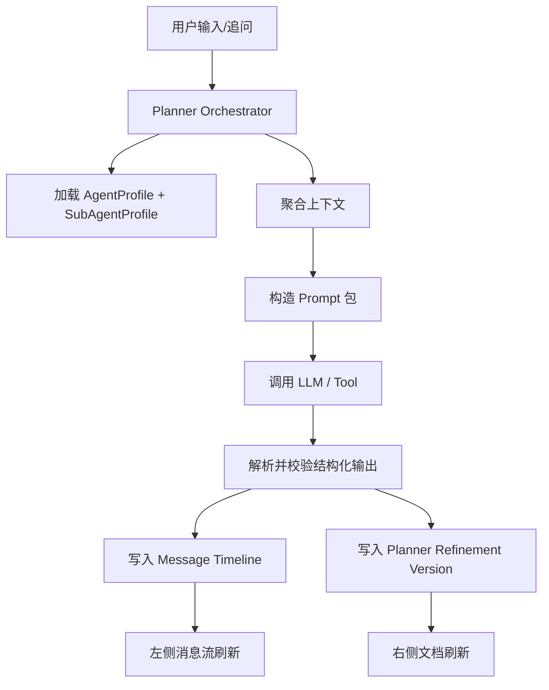

# Planner Agent 编排与调试规格（v0.1）

版本：v0.1  
日期：2026-03-14  
状态：专项设计稿（待并入 v0.3 基线）

当前阅读说明：

1. 本文已按 2026-03-14 当前实现做过一轮对齐。
2. 如需确认“哪些已经实现、哪些仍是目标态”，请同时参考：
   - `docs/reviews/planner-agent-doc-code-gap-review-2026-03-14.md`
   - `docs/reviews/planner-agent-final-decisions-2026-03-14.md`

## 1. 文档目的

本文件用于定义“剧本生成 / 策划阶段”的 Agent 编排模型，重点解决以下问题：

1. 不同内容类型与子类型需要独立提示词和处理逻辑。
2. Planner 左侧应呈现类似 Seko 的消息流、步骤分析、文档更新回执。
3. 右侧输出必须是高度结构化、可编辑、可版本化的策划文档。
4. Agent / Sub-Agent 需要可以被快速调整、调试、回放、对比和冻结版本。
5. 调试能力必须放在独立页面中，不进入主流程策划页。

本文件是以下文档的补充：

1. [backend-system-design-spec-v0.3.md](/Users/jiankunwu/project/aiv/docs/specs/backend-system-design-spec-v0.3.md)
2. [backend-data-api-spec-v0.3.md](/Users/jiankunwu/project/aiv/docs/specs/backend-data-api-spec-v0.3.md)
3. [state-machine-and-error-code-spec-v0.3.md](/Users/jiankunwu/project/aiv/docs/specs/state-machine-and-error-code-spec-v0.3.md)

## 2. 设计判断

不建议把每个子类型实现成完全独立、互不共享的一组后端服务。

建议采用：

1. `Planner Orchestrator`
2. `Agent Registry`
3. `AgentProfile`
4. `SubAgentProfile`
5. `StructuredDoc Schema`
6. `Message Timeline`

即：

1. 运行时只有一套统一的策划编排器。
2. 不同内容类型和子类型通过配置化 `AgentProfile / SubAgentProfile` 决定提示词、步骤、输出 schema 和后处理逻辑。
3. 对 LLM 的调用、运行记录、回放、失败处理、重试、权限和审计全部统一。

这样做的原因：

1. 避免每个子类型各自长出一套不可维护的流程。
2. 保证 Prompt、输出、步骤卡、文档结构有统一约束。
3. 便于后续做 A/B、回放、回归测试和模型切换。

## 3. 业务边界

Planner 阶段只负责：

1. 理解用户需求与上下文
2. 生成结构化策划文档
3. 支撑左侧消息流交互
4. 支撑文档编辑、版本切换和重生成
5. 在需要时派生后续 storyboard / creation 命令

Planner 阶段不直接负责：

1. 最终成片级图片生成编排
2. 最终成片级视频生成编排
3. 对口型生成
4. 导出

但 Planner 可以输出这些阶段需要的输入草稿与控制参数，也可以在 refinement 阶段管理规划期的主体图 / 场景图 / 分镜草图和素材绑定。

## 4. 内容类型与 Agent 层级

### 4.1 一级内容类型

1. `短剧漫剧`
2. `音乐MV`
3. `知识分享`

### 4.2 二级子类型

#### `短剧漫剧`

1. `对话剧情`
2. `旁白解说`

#### `音乐MV`

1. `剧情MV`
2. `表演MV`
3. `演唱MV`
4. `氛围MV`

#### `知识分享`

1. `知识科普`
2. `情感哲言`
3. `旅游宣传`
4. `历史文化`

### 4.3 设计原则

1. 每个二级子类型对应一个 `SubAgentProfile`。
2. 一级类型可有一个父级 `AgentProfile`，提供共享规则。
3. `SubAgentProfile` 可覆盖父级 Prompt、步骤定义、输出约束和默认参数。

## 5. 运行时模型

### 5.1 总体流程



### 5.2 Orchestrator 职责

`Planner Orchestrator` 负责：

1. 根据内容类型和子类型解析使用哪一个 `SubAgentProfile`
2. 聚合上下文
3. 生成 prompt 包
4. 调用模型
5. 解析输出
6. 校验 schema
7. 生成左侧消息流项
8. 生成右侧结构化文档版本
9. 记录完整调试与审计信息

以下能力不进入主流程策划页：

1. Prompt 原文编辑
2. Agent / Sub-Agent 手动切换
3. 调试 run 回放控制
4. A/B 对比面板
5. 原始上下文和原始模型返回查看

这些能力统一放在内部独立调试页。

## 6. 上下文输入设计

每次交互发给 LLM 的输入不能只有当前一句话，必须包含完整上下文快照。

### 6.1 基础输入

1. `project`
2. `episode`
3. `contentType`
4. `subtype`
5. `contentMode`
6. `scriptSourceName`
7. `scriptContent`

### 6.2 目录与配置输入

1. `selectedSubjectProfile`
2. `selectedStylePreset`
3. `selectedImageModel`
4. `plannerAspectRatio`
5. `storyboardModelSelection`

### 6.3 对话上下文

1. 最近 N 轮用户消息
2. 最近 N 轮 assistant 消息
3. 最近一次步骤分析
4. 最近一次文档更新回执

### 6.4 当前文档上下文

1. 当前激活的 `structuredDoc`
2. 当前版本号
3. 当前版本的生成 trigger
4. 当前版本的人工编辑 patch 摘要

### 6.5 操作意图

1. `update_document_only`
2. `update_document_and_prepare_storyboard`
3. `rerun_current_requirement`
4. `branch_new_version`
5. `reset_and_replan`

## 7. AgentProfile / SubAgentProfile 设计

### 7.0 存储原则

`AgentProfile / SubAgentProfile` 的运行时配置以数据库表为唯一真相来源。

约束如下：

1. 运行时不从代码文件读取 agent 配置。
2. 运行时不依赖本地 JSON / TS 常量作为正式配置源。
3. 文件内允许存在一次性初始化脚本或导入脚本，但这些脚本只负责把配置写入数据库。
4. 主流程、调试页、回放、A/B、发布都只读取数据库中的 profile 版本。
5. 任何 prompt、步骤定义、schema、tool policy 的生效版本，都必须能在表内查到并可审计。

### 7.1 `AgentProfile`

建议字段：

1. `id`
2. `contentType`
3. `displayName`
4. `description`
5. `defaultSystemPrompt`
6. `defaultDeveloperPrompt`
7. `defaultStepDefinitionsJson`
8. `defaultOutputSchemaJson`
9. `defaultInputSchemaJson`
10. `enabled`
11. `version`
12. `status`
13. `publishedAt`
14. `archivedAt`

### 7.2 `SubAgentProfile`

建议字段：

1. `id`
2. `agentProfileId`
3. `subtype`
4. `displayName`
5. `description`
6. `systemPromptOverride`
7. `developerPromptOverride`
8. `stepDefinitionsJson`
9. `outputSchemaJson`
10. `inputSchemaJson`
11. `toolPolicyJson`
12. `defaultGenerationConfigJson`
13. `enabled`
14. `version`
15. `status`
16. `publishedAt`
17. `archivedAt`

### 7.3 Prompt 组合规则

运行时 Prompt 包按以下顺序拼装：

1. 平台系统级约束
2. Planner 通用系统提示词
3. `AgentProfile.defaultSystemPrompt`
4. `SubAgentProfile.systemPromptOverride`
5. Planner 通用 developer 提示词
6. `AgentProfile.defaultDeveloperPrompt`
7. `SubAgentProfile.developerPromptOverride`
8. 当前上下文 JSON

## 8. 输出协议

LLM 输出必须是严格 JSON，不允许“以自然语言为主、结构字段为辅”。

### 8.1 顶层输出包

```json
{
  "assistantMessage": "收到，我会先重构故事结构，再更新右侧文档。",
  "stepAnalysis": [],
  "documentTitle": "雨夜街头的橘色微光",
  "structuredDoc": {},
  "operations": {
    "replaceDocument": true,
    "generateStoryboard": false
  }
}
```

### 8.2 `stepAnalysis`

建议结构：

```json
[
  {
    "id": "narrative",
    "title": "规划雨夜街头橘猫的治愈系故事背景",
    "status": "done",
    "details": [
      "确定 1 个场景",
      "限制为 3 个分镜",
      "控制总时长约 10 秒"
    ],
    "tags": ["故事结构", "时长控制"]
  }
]
```

### 8.3 `structuredDoc`

建议固定结构：

```json
{
  "projectTitle": "雨夜街头的橘色微光",
  "episodeTitle": "第1集：橘猫的避雨时刻",
  "summaryBullets": [],
  "highlights": [],
  "styleBullets": [],
  "subjectBullets": [],
  "sceneBullets": [],
  "scriptSummary": [],
  "acts": [
    {
      "id": "act-1",
      "title": "第一幕",
      "time": "夜晚",
      "location": "雨夜街头",
      "shots": [
        {
          "id": "shot-1",
          "title": "镜头1",
          "durationSeconds": 3.5,
          "visual": "",
          "composition": "",
          "motion": "",
          "voice": "",
          "line": ""
        }
      ]
    }
  ]
}
```

## 9. 左侧消息流设计

参考 Seko 左侧交互，消息流应拆成多种消息类型，而不是纯文本。

### 9.1 消息类型

1. `user_text`
2. `assistant_text`
3. `assistant_steps`
4. `assistant_document_receipt`
5. `assistant_error`

### 9.2 典型消息序列

1. 用户原始需求
2. assistant 短确认话术
3. assistant 步骤分析卡
4. assistant 文档更新回执
5. 用户追问 / 重做指令
6. assistant 新一轮确认
7. assistant 新版本步骤分析卡
8. assistant 新版本回执

### 9.3 `assistant_document_receipt`

建议包含：

1. 文档标题
2. 更新时间
3. 当前版本号
4. 是否已替换右侧文档
5. 下一步建议动作

## 10. 数据表建议

### 10.1 `planner_agent_profiles`

主要字段：

1. `id`
2. `content_type`
3. `display_name`
4. `description`
5. `default_system_prompt`
6. `default_developer_prompt`
7. `default_step_definitions_json`
8. `default_output_schema_json`
9. `default_input_schema_json`
10. `enabled`
11. `version`
12. `created_at`
13. `updated_at`

### 10.2 `planner_sub_agent_profiles`

主要字段：

1. `id`
2. `agent_profile_id`
3. `subtype`
4. `display_name`
5. `description`
6. `system_prompt_override`
7. `developer_prompt_override`
8. `step_definitions_json`
9. `output_schema_json`
10. `input_schema_json`
11. `tool_policy_json`
12. `default_generation_config_json`
13. `enabled`
14. `version`
15. `created_at`
16. `updated_at`

### 10.3 `planner_messages`

主要字段：

1. `id`
2. `planner_session_id`
3. `refinement_version_id`
4. `role`
5. `message_type`
6. `content_json`
7. `sequence_no`
8. `created_at`

### 10.4 `planner_refinement_versions`

主要字段：

1. `id`
2. `planner_session_id`
3. `version_number`
4. `trigger_type`
5. `instruction`
6. `assistant_message`
7. `structured_doc_json`
8. `generated_text`
9. `status`
10. `progress_percent`
11. `error_code`
12. `error_message`
13. `is_active`
14. `agent_profile_id`
15. `sub_agent_profile_id`
16. `model_snapshot_json`
17. `input_snapshot_json`
18. `created_by_id`
19. `created_at`
20. `updated_at`

### 10.5 `planner_step_analysis`

主要字段：

1. `id`
2. `refinement_version_id`
3. `step_key`
4. `title`
5. `status`
6. `details_json`
7. `tags_json`
8. `sort_order`

## 11. 调试与提示词治理

这是本系统的核心要求，不是可选增强。

### 11.1 设计目标

必须支持：

1. 快速修改 `AgentProfile / SubAgentProfile`
2. 快速查看某次运行到底用了哪版 prompt
3. 快速回放相同输入
4. 快速比较不同 prompt / 模型的输出差异
5. 快速定位“哪一步把结果带偏了”

### 11.2 Prompt 冻结

每次 run 必须保存完整快照：

1. `systemPromptFinal`
2. `developerPromptFinal`
3. `messagesFinal`
4. `modelSelectionSnapshot`
5. `inputContextSnapshot`
6. `outputRawText`
7. `outputParsedJson`

不能只保存 profile id，否则后续无法复现。

### 11.3 Prompt 调试页

建议做一个内部调试页，至少支持：

1. 选择 `contentType + subtype`
2. 选择模型
3. 编辑 system/developer prompt
4. 注入上下文 JSON
5. 单步运行
6. 查看原始输入包
7. 查看原始输出文本
8. 查看解析后的结构化 JSON
9. 查看 schema 校验错误
10. 一键保存为新 profile 版本

页面边界要求：

1. 调试页是独立内部页面，不挂在 `/projects/:projectId/planner` 的常规交互区。
2. 主流程 planner 页只负责正常生成、查看消息流、查看文档、切换版本、继续追问。
3. 调试页负责 Prompt 调整、Agent 覆盖、上下文注入、回放和 A/B。
4. 调试页触发的运行必须带 `debug` 标记，不能和主流程 run 混用。

### 11.4 运行回放

每次 planner run 要支持：

1. 从历史 run 打开
2. 查看所用 agent/sub-agent 版本
3. 查看 prompt 快照
4. 查看输入上下文
5. 查看最终 structuredDoc
6. 以相同输入重新运行

### 11.5 A/B 对比

建议支持对同一输入进行双跑：

1. `profile A + model A`
2. `profile B + model B`

对比维度：

1. assistantMessage
2. steps
3. structuredDoc
4. 分镜数量
5. 字段完整度
6. 长度与成本

### 11.6 Prompt 发布策略

不要让线上配置直接被手改覆盖。

建议状态：

1. `draft`
2. `active`
3. `deprecated`

规则：

1. 调试页先保存为 `draft`
2. 验证通过后再切为 `active`
3. 旧版本保留可回放

## 12. API 建议

### 12.1 Planner 运行接口

1. `POST /api/projects/:projectId/planner/generate-doc`
2. `PUT /api/projects/:projectId/planner/document`
3. `GET /api/projects/:projectId/planner/workspace`
4. `POST /api/projects/:projectId/planner/outline-versions/:versionId/activate`
5. `POST /api/projects/:projectId/planner/outline-versions/:versionId/confirm`
6. `POST /api/projects/:projectId/planner/refinement-versions/:versionId/activate`
7. `POST /api/projects/:projectId/planner/partial-rerun`

### 12.2 Agent 配置接口

1. `GET /api/planner/agent-profiles`
2. `PATCH /api/planner/sub-agent-profiles/:id`
3. `GET /api/planner/sub-agent-profiles/:id/releases`
4. `POST /api/planner/sub-agent-profiles/:id/publish`

### 12.3 调试接口

1. `POST /api/planner/debug/run`
2. `GET /api/planner/debug/runs`
3. `GET /api/planner/debug/runs/:runId`
4. `POST /api/planner/debug/runs/:runId/replay`
5. `POST /api/planner/debug/compare`

### 12.4 调试页面建议

建议独立提供：

1. `/internal/planner-agents`
2. `/internal/planner-debug`
3. `/internal/planner-debug/:subAgentSlug`
4. `/internal/planner-debug/compare`
5. `/internal/planner-debug/runs`
6. `/internal/planner-debug/runs/:runId`

不建议：

1. 在主流程 planner 页暴露 Prompt 编辑器
2. 在主流程左侧消息区暴露 Agent 切换器
3. 在主流程右侧文档区暴露原始上下文快照或原始模型输出

## 13. 前端迁移建议

### 13.1 Planner 页改造方向

现有 Planner 页可以复用右侧文档壳，但要做以下改造：

1. 左侧从本地模拟步骤改成真实消息流
2. `use-planner-refinement.ts` 逐步退位为纯 UI 层 hook
3. 文档内容从后端 `structuredDoc` 驱动
4. 版本切换从后端 active version 驱动

### 13.2 迁移阶段

#### 第一阶段

1. 跑通 `generate-doc -> run -> structuredDoc -> workspace`
2. 左侧只展示基础消息流
3. 右侧展示真实文档

#### 第二阶段

1. 增加步骤分析卡
2. 增加版本切换
3. 增加人工编辑回写

#### 第三阶段

1. 增加调试页
2. 增加 prompt 版本管理
3. 增加回放与 A/B 对比

## 14. 实施优先级

### P0

1. 定义 `AgentProfile / SubAgentProfile`
2. 定义统一输出 schema
3. 增加 `planner_messages / planner_refinement_versions / planner_step_analysis`
4. 跑通真实 planner run 闭环

### P1

先落 3 个代表性 agent：

1. `短剧漫剧 / 对话剧情`
2. `音乐MV / 剧情MV`
3. `知识分享 / 知识科普`

### P2

1. 扩到全部子类型
2. 接入文档编辑回写
3. 接入 storyboard 派生

### P3

1. 补调试页
2. 补回放与对比
3. 补 prompt 发布治理

## 15. 明确结论

1. Planner 阶段采用“统一编排器 + 多个可配置 AgentProfile”的模型。
2. 每个子类型都应该有独立的提示词和步骤逻辑，但运行框架统一。
3. 左侧消息流与右侧结构化文档必须彻底分离。
4. Prompt 调试、回放、A/B、版本冻结必须作为一等能力进入设计，不后置。
5. 后续实现时，优先保证“可调试”和“可复现”，再追求更多自动化步骤。
