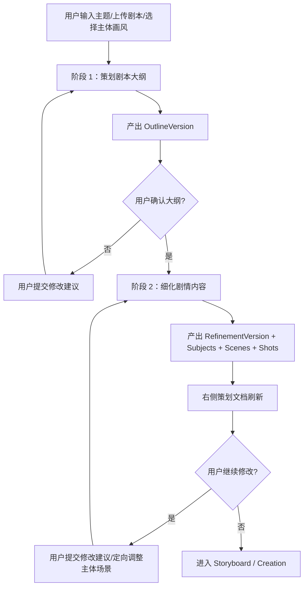

# Planner 两阶段工作流与结构化文档规格（v0.1）

版本：v0.1  
日期：2026-03-14  
状态：专项设计稿（待并入 v0.3 基线）

当前阅读说明：

1. 本文中的 Outline / Refinement 两阶段模型已与当前主实现进行过一次对齐。
2. 如需确认剩余未完成项与最终边界，请同时参考：
   - `docs/reviews/planner-agent-doc-code-gap-review-2026-03-14.md`
   - `docs/reviews/planner-agent-final-decisions-2026-03-14.md`

## 1. 文档目的

本文件用于基于 [`plan.html`](/Users/jiankunwu/project/aiv/plan.html) 中复制自 Seko 规划页的真实内容，反推策划阶段的产品流程、结构化产物和后端实现方式。

本文件重点回答以下问题：

1. 左侧 AI 工作区和右侧策划产出区分别承担什么职责。
2. “策划剧本大纲”和“细化剧情内容”是两个什么阶段，输入和输出分别是什么。
3. 用户如何基于上次产出继续追问、修改、重跑，并保持版本一致性。
4. 主体、场景、上传剧本、主体单独调整等能力应当在何时出现。
5. 这个功能应该如何在现有 `Planner Orchestrator + AgentProfile/SubAgentProfile` 体系下落地。

本文件是以下文档的补充：

1. [planner-agent-orchestration-spec-v0.1.md](/Users/jiankunwu/project/aiv/docs/specs/planner-agent-orchestration-spec-v0.1.md)
2. [backend-system-design-spec-v0.3.md](/Users/jiankunwu/project/aiv/docs/specs/backend-system-design-spec-v0.3.md)
3. [backend-data-api-spec-v0.3.md](/Users/jiankunwu/project/aiv/docs/specs/backend-data-api-spec-v0.3.md)
4. [database-schema-spec-v0.3.md](/Users/jiankunwu/project/aiv/docs/specs/database-schema-spec-v0.3.md)

## 2. 反推结论

### 2.1 Seko 的 Planner 不是“一次生成”

从 [`plan.html`](/Users/jiankunwu/project/aiv/plan.html) 可以明确判断，Seko 规划页是一个两阶段策划工作流：

1. `策划剧本大纲`
2. `细化剧情内容`

这两个阶段不是同一个输出对象的不同显示方式，而是两个不同粒度的产物：

1. 大纲阶段产出的是系列/故事级规划。
2. 细化阶段产出的是可直接进入生产的剧集级文档。

### 2.2 左侧和右侧职责不同

#### 左侧 AI 工作区

左侧是“会话工作区”，负责：

1. 接收用户输入
2. 显示 assistant 确认话术
3. 显示步骤分析
4. 显示文档更新回执
5. 承载后续修改建议和重跑过程

#### 右侧策划产出区

右侧是“当前激活版本的结构化策划文档”，负责：

1. 展示当前 episode 的正式策划结果
2. 支持文档内字段编辑
3. 支持主体、场景、分镜内容的局部更新
4. 作为后续 storyboard / creation 的输入来源

结论：

1. 左侧是 `Message Timeline`
2. 右侧是 `Structured Planning Document`
3. 两者必须分表、分对象、分状态管理

### 2.3 当前代码结构的主要问题

当前 [`planner-doc.ts`](/Users/jiankunwu/project/aiv/apps/api/src/lib/planner-doc.ts) 和 [`planner-structured-doc.ts`](/Users/jiankunwu/project/aiv/apps/web/src/features/planner/lib/planner-structured-doc.ts) 中的 `PlannerStructuredDoc` 已经接近右侧文档结构，但仍存在一个关键问题：

1. 它把“大纲阶段产物”和“细化阶段产物”混在一个 schema 里了。

后续应当拆成：

1. `OutlineDoc`
2. `RefinementDoc`

否则会出现以下问题：

1. 大纲阶段输出字段过少，难以适配当前大而全的 schema。
2. 细化阶段字段过多，导致大纲阶段只能用占位和伪数据填充。
3. 用户修改大纲和修改细化文档时，版本语义不清晰。

## 3. 产品工作流拆解

### 3.1 总体流程



### 3.2 阶段 1：策划剧本大纲

#### 输入

1. 用户原始需求文本
2. 上传剧本内容或附件文本
3. 一级内容类型与二级子类型
4. 首页选择的主体、画风、主体图模型
5. 项目模式
   - `single`
   - `series`
6. 其他显式约束
   - 集数
   - 时长
   - 题材
   - 目标受众
   - 表达形式

#### 输出

左侧：

1. assistant 确认话术
2. `剧本大纲` 卡片

右侧：

1. 此阶段通常不直接写完整右侧正式文档
2. 只生成可确认的大纲版本

#### 结构化产物

建议定义为 `OutlineDoc`：

```ts
interface OutlineDoc {
  projectTitle: string;
  contentType: 'drama' | 'mv' | 'knowledge';
  subtype: string;
  format: 'single' | 'series';
  episodeCount: number;
  targetDurationSeconds?: number;
  genre: string;
  toneStyle: string[];
  premise: string;
  mainCharacters: Array<{
    id: string;
    name: string;
    role: string;
    description: string;
  }>;
  storyArc: Array<{
    episodeNo: number;
    title: string;
    summary: string;
  }>;
  constraints: string[];
  openQuestions: string[];
}
```

#### 左侧线程中对应的消息类型

1. `user_requirement`
2. `assistant_ack`
3. `assistant_outline_card`

### 3.3 阶段 2：用户修改大纲并重产

#### 输入

1. 当前激活 `OutlineVersion`
2. 用户新增修改建议
3. 最近几轮对话上下文
4. 项目入口配置快照

#### 输出

1. 新的 `OutlineVersion`
2. 左侧新增一轮消息：
   - 用户修改建议
   - assistant 解释
   - assistant 更新后的大纲卡片
3. 旧版本保留，可回放、可切换、可对比

#### 设计原则

1. 不能覆盖旧版大纲。
2. 需要显式区分 `outline_confirmed` 与 `outline_superseded`。
3. 用户确认动作应绑定某个 `OutlineVersion`，而不是绑定“当前页面状态”。

### 3.4 阶段 3：确认大纲后，进入细化剧情内容

这是整个策划页的核心阶段。

从 [`plan.html`](/Users/jiankunwu/project/aiv/plan.html) 可以确认，此阶段左侧出现：

1. 欢迎/承接话术
2. 步骤分析列表
3. 文档更新回执

同时右侧会开始生成完整的策划文档，包括：

1. `故事梗概`
2. `美术风格`
3. `主体列表`
4. `场景列表`
5. `分镜剧本`

#### 输入

1. 已确认的 `OutlineVersion`
2. 当前激活的 `episode`
3. 一级类型 + 二级子类型对应的 `SubAgentProfile`
4. 用户附加约束
5. 当前模型选择、画幅比例等配置
6. 可选上传剧本全文

#### 输出

左侧：

1. `assistant_ack`
2. `assistant_step_analysis`
3. `assistant_document_receipt`

右侧：

1. `RefinementDoc`

#### 结构化产物

建议定义为 `RefinementDoc`：

```ts
interface RefinementDoc {
  projectTitle: string;
  episodeTitle: string;
  episodeCount: number;
  pointCost: number;
  summary: {
    contentSummary: string[];
    highlights: Array<{ title: string; description: string }>;
  };
  artStyle: {
    styleBullets: string[];
  };
  subjects: Array<{
    id: string;
    name: string;
    role: string;
    appearance: string;
    personality?: string;
    prompt: string;
    negativePrompt?: string;
    referenceAssetIds: string[];
    generatedAssetIds: string[];
    editable: boolean;
  }>;
  scenes: Array<{
    id: string;
    name: string;
    time: string;
    locationType: 'indoor' | 'outdoor' | 'mixed' | 'other';
    description: string;
    prompt: string;
    negativePrompt?: string;
    referenceAssetIds: string[];
    generatedAssetIds: string[];
    editable: boolean;
  }>;
  scriptSummary: string[];
  acts: Array<{
    id: string;
    title: string;
    time: string;
    location: string;
    shots: Array<{
      id: string;
      shotNo: string;
      title: string;
      durationSeconds?: number;
      visualDescription: string;
      composition: string;
      cameraMotion: string;
      voiceRole: string;
      dialogue: string;
      subjectIds: string[];
      sceneId?: string;
    }>;
  }>;
  storyboardConfig: {
    imageModelEndpointId?: string;
    aspectRatio: '16:9' | '9:16' | '4:3' | '3:4';
  };
}
```

#### 左侧步骤分析卡结构

Seko 的左侧步骤卡不是自由文本，而是结构化项目列表。建议定义：

```ts
interface StepAnalysisItem {
  id: string;
  title: string;
  status: 'waiting' | 'running' | 'done' | 'failed';
  details: string[];
  toolHints?: Array<{
    code: string;
    label: string;
  }>;
}
```

例如：

1. 规划故事背景
2. 定义视觉基调
3. 设计角色特征
4. 生成角色图
5. 设计场景细节
6. 生成场景图
7. 拆解关键分镜

### 3.5 阶段 4：用户修改细化内容并重产

#### 输入

1. 当前激活 `RefinementVersion`
2. 用户修改建议
3. 最近对话上下文
4. 右侧当前 `RefinementDoc`
5. 若用户定向修改主体或场景，则带入被修改对象的当前快照

#### 输出

1. 新的 `RefinementVersion`
2. 左侧新增消息：
   - 用户建议
   - assistant 确认
   - 新的 `stepAnalysis`
   - 新的 `documentReceipt`
3. 右侧刷新为新版本文档

#### 定向重产模式

此阶段应支持两类修改：

1. 整体重跑
2. 局部重跑

局部重跑包括：

1. 只改某个主体
2. 只改某个场景
3. 只改某一幕或某几个分镜

工程实现上，建议统一走“生成新版本”，但允许记录 `scope`：

1. `full`
2. `subject_only`
3. `scene_only`
4. `shots_only`

## 4. 主体、场景、上传剧本、单独调整的生命周期

### 4.1 上传剧本

上传剧本应归属于 `Planner Input Package`，而不是后期 patch。

它可以在以下两个时点进入：

1. 创建项目时
2. 大纲或细化阶段再次追问时

作用：

1. 作为大纲生成的主要上下文
2. 在细化阶段作为剧情细节来源

### 4.2 主体

主体在两个阶段的语义不同：

#### 大纲阶段

1. 主体只是角色信息
2. 形态是 `mainCharacters[]`

#### 细化阶段

1. 主体成为生产对象
2. 具备独立 prompt、参考图、生成图、标签和后续复用价值

因此应拆成两个层：

1. `OutlineCharacter`
2. `PlannerSubject`

### 4.3 场景

场景同理：

#### 大纲阶段

1. 只是背景设定和环境信息

#### 细化阶段

1. 成为生产对象
2. 具备可单独重做、单独生图、单独挂引用素材的能力

### 4.4 何时允许单独调整主体/场景

应当在 `RefinementVersion` 首次产出之后允许。

因为只有在这时系统才有：

1. 稳定的主体 ID
2. 稳定的场景 ID
3. 这些对象和分镜的引用关系

### 4.5 主体单独调整的动作设计

主体单独调整建议支持以下动作：

1. 改名称
2. 改角色描述
3. 改外观设定
4. 改 prompt / negative prompt
5. 上传参考图
6. 重新生成主体图
7. 把更新同步到关联 shots

### 4.6 场景单独调整的动作设计

场景单独调整建议支持以下动作：

1. 改场景描述
2. 改时空信息
3. 改 prompt / negative prompt
4. 上传参考图
5. 重新生成场景图
6. 把更新同步到关联 shots

## 5. 左侧消息流与右侧文档的系统模型

### 5.1 左侧消息流模型

建议 `planner_messages` 至少支持以下类型：

1. `user_requirement`
2. `user_feedback`
3. `assistant_ack`
4. `assistant_outline_card`
5. `assistant_step_analysis`
6. `assistant_document_receipt`
7. `system_transition`

设计原则：

1. 左侧消息是事件流，不是当前文档快照。
2. 左侧消息不承担业务真相，只承担过程可见性和回放。
3. 每条消息应可关联某个 `runId` 或 `versionId`。

### 5.2 右侧文档模型

右侧只展示“当前激活版本”的结构化结果。

建议支持两套版本表：

1. `planner_outline_versions`
2. `planner_refinement_versions`

其中：

1. 大纲确认前，右侧可显示简化的大纲视图或占位状态。
2. 进入细化阶段后，右侧主视图切换为 `RefinementDoc`。

### 5.3 为什么不能只保留一个文档表

如果只保留一个 `planner_refinement_versions`，会造成：

1. 大纲确认动作没有独立版本点
2. 用户修改大纲会污染细化文档生命周期
3. 后续难以做“确认大纲后再开始细化”的 gating

因此必须将：

1. `OutlineVersion`
2. `RefinementVersion`

明确拆开。

## 6. 推荐的数据模型

### 6.1 版本对象

#### `planner_outline_versions`

主要字段：

1. `id`
2. `planner_session_id`
3. `version_number`
4. `trigger_type`
5. `status`
6. `instruction`
7. `outline_doc_json`
8. `input_snapshot_json`
9. `model_snapshot_json`
10. `is_confirmed`
11. `confirmed_at`
12. `is_active`
13. `created_by_id`
14. `created_at`

#### `planner_refinement_versions`

主要字段：

1. `id`
2. `planner_session_id`
3. `outline_version_id`
4. `version_number`
5. `trigger_type`
6. `scope`
7. `status`
8. `instruction`
9. `structured_doc_json`
10. `input_snapshot_json`
11. `model_snapshot_json`
12. `is_active`
13. `created_by_id`
14. `created_at`

### 6.2 资产对象

#### `planner_subjects`

主要字段：

1. `id`
2. `refinement_version_id`
3. `name`
4. `role`
5. `appearance`
6. `personality`
7. `prompt`
8. `negative_prompt`
9. `reference_asset_bundle_json`
10. `generated_asset_bundle_json`
11. `sort_order`
12. `editable`

#### `planner_scenes`

主要字段：

1. `id`
2. `refinement_version_id`
3. `name`
4. `time`
5. `location_type`
6. `description`
7. `prompt`
8. `negative_prompt`
9. `reference_asset_bundle_json`
10. `generated_asset_bundle_json`
11. `sort_order`
12. `editable`

#### `planner_shot_scripts`

主要字段：

1. `id`
2. `refinement_version_id`
3. `act_id`
4. `scene_id`
5. `shot_no`
6. `title`
7. `duration_seconds`
8. `visual_description`
9. `composition`
10. `camera_motion`
11. `voice_role`
12. `dialogue`
13. `subject_bindings_json`
14. `sort_order`

### 6.3 事件对象

#### `planner_messages`

主要字段：

1. `id`
2. `planner_session_id`
3. `role`
4. `message_type`
5. `content_json`
6. `outline_version_id`
7. `refinement_version_id`
8. `run_id`
9. `created_at`

#### `planner_step_analysis`

主要字段：

1. `id`
2. `refinement_version_id`
3. `step_key`
4. `title`
5. `status`
6. `details_json`
7. `tool_hints_json`
8. `sort_order`

## 7. 技术实现建议

### 7.1 核心实现原则

1. LLM 输出必须是强结构化 JSON。
2. 左侧线程和右侧文档必须分别持久化。
3. 任务执行必须异步化，不能把长生成阻塞在请求里。
4. 运行过程必须可回放、可调试、可追踪。

### 7.2 推荐技术栈

后端：

1. Node.js
2. TypeScript
3. MySQL
4. Prisma
5. Redis
6. BullMQ

结构化校验：

1. Zod
2. Ajv（可选）

观测与调试：

1. Langfuse
2. OpenTelemetry
3. 现有 `/internal/planner-agents` 与 `/internal/planner-debug/*`

工作流编排：

第一阶段建议：

1. `BullMQ + 自研 Planner Orchestrator`

后续复杂度上来后可评估：

1. Temporal
2. Trigger.dev
3. Inngest

### 7.3 为什么当前阶段不建议重度引入 LangChain

1. Planner 的核心难点不是链式 prompt 编排，而是版本、结构化输出和调试治理。
2. 目前你们已经有数据库表驱动的 `AgentProfile/SubAgentProfile` 体系。
3. 如果再叠一层重度框架，会增加黑盒感，不利于 prompt 迭代。

因此建议：

1. Prompt 模板存在数据库
2. Orchestrator 自己拼装上下文
3. 输出走 schema 校验
4. 调试、回放、A/B 自己掌控

## 8. 与现有代码的收敛建议

### 8.1 需要保留的部分

1. [`planner-agent-orchestration-spec-v0.1.md`](/Users/jiankunwu/project/aiv/docs/specs/planner-agent-orchestration-spec-v0.1.md) 中的 `AgentProfile / SubAgentProfile / Debug` 设计
2. 当前 `planner_messages / planner_refinement_versions / planner_step_analysis` 的运行时思路

### 8.2 需要调整的部分

1. [`planner-doc.ts`](/Users/jiankunwu/project/aiv/apps/api/src/lib/planner-doc.ts) 里的单一 `PlannerStructuredDoc`
2. [`planner-structured-doc.ts`](/Users/jiankunwu/project/aiv/apps/web/src/features/planner/lib/planner-structured-doc.ts) 里的单一前端 DTO

建议拆为：

1. `OutlineDoc`
2. `RefinementDoc`
3. `PlannerWorkspaceDto`

### 8.3 Planner Workspace 聚合响应建议

```ts
interface PlannerWorkspaceDto {
  project: {
    id: string;
    title: string;
    contentMode: 'single' | 'series';
    contentType: string;
    subtype: string;
  };
  plannerSession: {
    id: string;
    stage: 'outline' | 'refinement';
    status: 'idle' | 'running' | 'ready' | 'failed';
    activeOutlineVersionId?: string;
    activeRefinementVersionId?: string;
  };
  messages: PlannerMessageDto[];
  activeOutline?: OutlineDoc;
  activeRefinement?: RefinementDoc;
  outlineVersions: PlannerOutlineVersionDto[];
  refinementVersions: PlannerRefinementVersionDto[];
}
```

## 9. 实施顺序

### P0

1. 定义 `OutlineDoc`
2. 定义 `RefinementDoc`
3. 新增 `planner_outline_versions`
4. 重构 `PlannerWorkspaceDto`

### P1

1. 跑通“大纲生成 -> 修改大纲 -> 确认大纲”
2. 左侧消息流接真实 `planner_messages`
3. 右侧在大纲阶段支持简化视图

### P2

1. 跑通“细化剧情内容 -> 右侧完整文档”
2. 生成 `subjects / scenes / shots`
3. 支持 `stepAnalysis` 和 `documentReceipt`

### P3

1. 主体单独调整
2. 场景单独调整
3. 局部分镜重跑

### P4

1. 主体图生成
2. 场景图生成
3. 分镜草图生成
4. 将产物回写至 `RefinementDoc`

## 10. 决策结论

本功能应按以下原则实现：

1. 采用两阶段策划模型，而不是单阶段大文档生成。
2. 左侧线程和右侧文档分离建模。
3. 大纲版本与细化版本分离建模。
4. 主体和场景在细化阶段首次成为生产对象。
5. 用户修改必须生成新版本，不能覆盖旧版。
6. 调试能力继续留在独立内部页，不进入主流程。
7. 运行时配置继续以数据库表为唯一真相来源。
